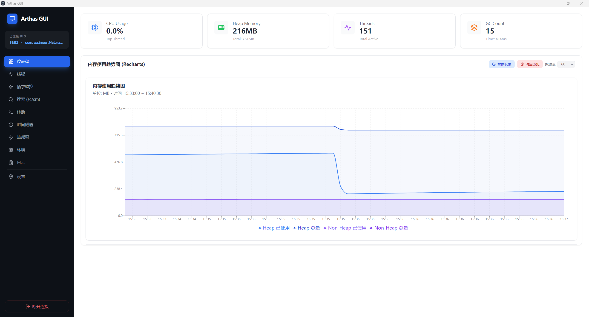
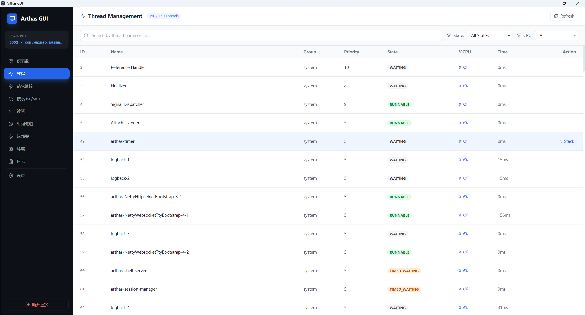
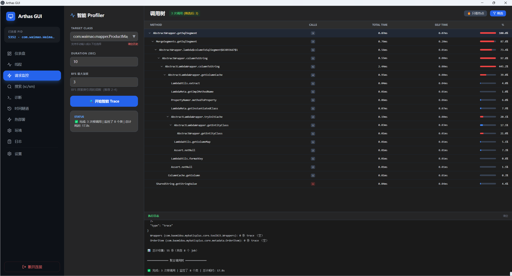
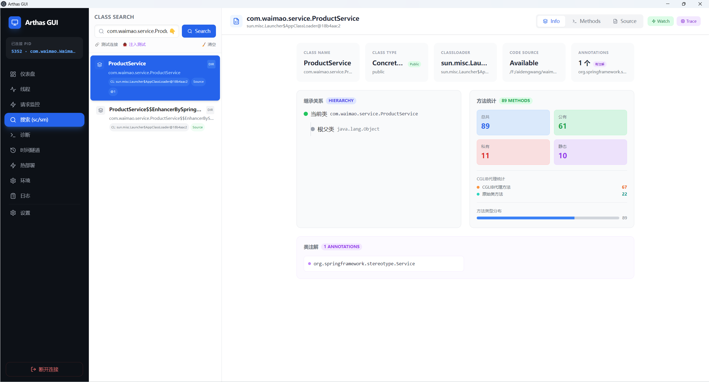
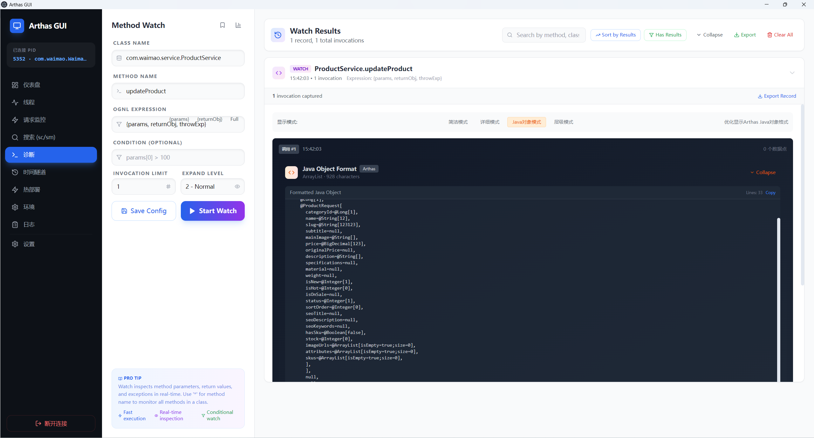
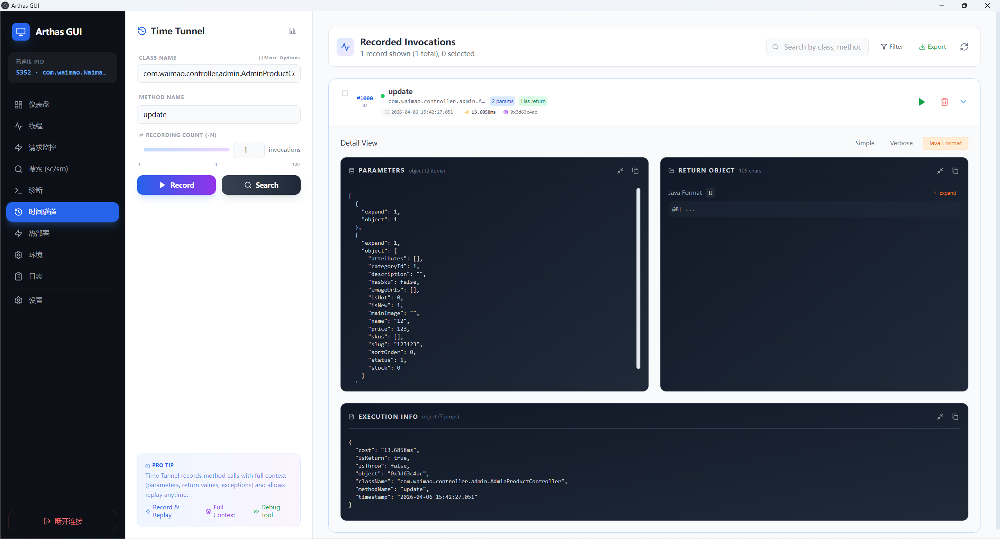
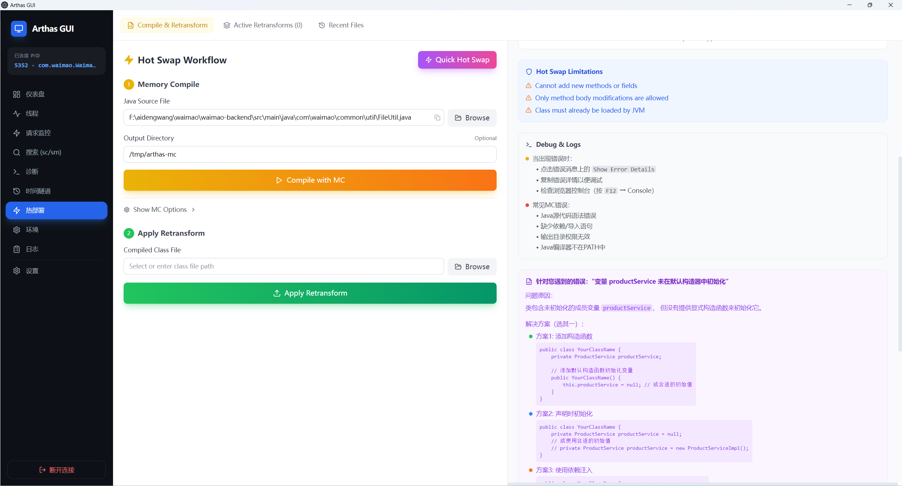
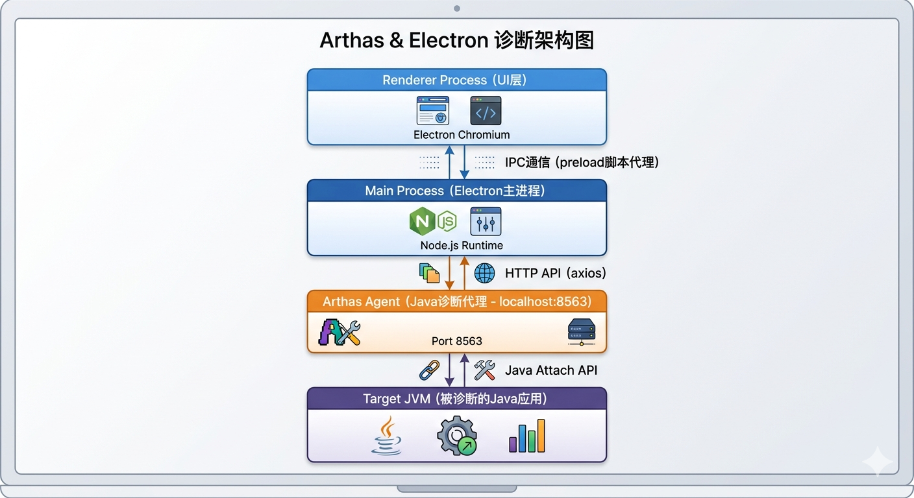

# Arthas GUI - Java应用诊断与热修复平台

> 基于 Electron + React + TypeScript + Vite 构建的企业级 Java 应用诊断与热修复一体化桌面平台

## 🚀 项目概述

Arthas GUI 是一个现代化的桌面应用程序，它为阿里巴巴开源的 Java 诊断工具 [Arthas](https://github.com/alibaba/arthas) 提供了直观的图形界面。该平台将命令行工具的复杂功能转化为用户友好的可视化界面，极大降低了 Java 应用诊断和动态热修复的门槛。

**核心价值：**
- 🖥️ **直观可视化**：将 Arthas 复杂的 CLI 命令转化为直观的 UI
- ⚡ **一键热修复**：无需重启服务，直接在运行时修改 Java 代码
- 🔍 **全方位诊断**：从 JVM 指标到方法级调用跟踪全覆盖
- 🎯 **企业级体验**：现代化的 UI/UX 设计，支持中英文双语

## 🎯 主要功能特性

### 1. **仪表板监控 (Dashboard)**
- 实时 JVM 性能指标监控
- CPU、内存、线程、GC 状态可视化
- 系统属性和环境变量查看


### 2. **线程分析 (Threads)**
- 实时线程状态监控
- 线程堆栈跟踪分析
- 死锁检测与定位

### 3. **请求监控 (Request Monitor)**
- 实时 HTTP 请求追踪
- 性能瓶颈分析
- 慢查询识别

### 4. **类搜索 (Class Search)**
- 全盘类与方法搜索 (sc/sm 命令)
- 类的详细信息查看
- 字节码反编译 (jad)

### 5. **方法诊断 (Diagnostics)**
- 方法调用监控 (watch)
- 调用链跟踪 (trace)
- 参数与返回值实时观察

### 6. **时间隧道 (Time Tunnel / tt)**
- 方法调用历史记录
- 调用重放与调试
- 批量操作支持

### 7. **🔥 热修复 (Hot Swap)**
- **内存编译 (MC)**：修改 Java 源代码并直接编译到内存
- **实时重转换 (Retransform)**：将编译后的类重新加载到运行中的 JVM
- **智能错误处理**：友好的编译错误提示和解决方案指南
- **路径标准化**：自动处理 Windows/Unix 路径格式转换

### 8. **环境配置 (Environment)**
- JVM 参数查看与修改
- 系统属性动态调整

### 9. **日志管理 (Logger)**
- 运行时日志级别调整
- 日志配置动态修改

## 🏗️ 技术架构

### 前端技术栈
- **Electron**: 跨平台桌面应用框架
- **React 18**: 用户界面构建
- **TypeScript**: 类型安全的 JavaScript 开发
- **Vite**: 极速的开发构建工具
- **Tailwind CSS**: 现代化的 CSS 框架
- **Recharts**: 数据可视化图表库

### 核心通信架构


### 项目结构
```
arthas-gui/
├── src/
│   ├── main/                    # Electron 主进程
│   │   └── index.ts            # 进程管理、IPC处理、Arthas连接
│   ├── preload/                # 预加载脚本
│   │   └── index.ts           # 安全的API暴露层
│   └── renderer/               # 前端渲染进程
│       ├── src/
│       │   ├── components/     # React组件
│       │   │   ├── Dashboard.tsx       # 仪表板
│       │   │   ├── HotSwap.tsx         # 热修复界面
│       │   │   ├── ClassSearch.tsx     # 类搜索
│       │   │   ├── Diagnostics.tsx     # 方法诊断
│       │   │   ├── TimeTunnel.tsx      # 时间隧道
│       │   │   └── ...
│       │   ├── utils/
│       │   │   ├── arthas.ts           # Arthas API封装
│       │   │   ├── i18n.tsx            # 国际化
│       │   │   └── usePersistentState.ts # 持久化状态
│       │   └── App.tsx         # 主应用组件
│       └── index.html          # HTML入口
├── resources/                  # 静态资源
│   └── arthas-boot.jar        # Arthas启动器
├── dist/                      # 构建输出目录
└── package.json              # 项目配置
```

### 核心模块说明

#### **1. Arthas API 模块 (`src/renderer/src/utils/arthas.ts`)**
- **会话管理**: 自动处理 Arthas HTTP API 会话
- **同步/异步执行**: 根据命令类型选择合适的执行策略
- **错误处理**: 统一的错误处理机制
- **路径标准化**: 自动转换 Windows/Unix 路径格式

```typescript
// 路径标准化函数 - 处理Windows路径转义问题
function normalizePath(path: string): string {
  return path.replace(/\\\\\\\\/g, '/').replace(/\\\\/g, '/')
}
```

#### **2. 热修复模块 (`src/renderer/src/components/HotSwap.tsx`)**
- **MC命令封装**: 内存编译Java源代码
- **智能错误解析**: 解析Java编译错误并提供解决方案
- **重转换管理**: 管理应用中的重转换类列表
- **快速热修复**: 一键完成编译+重转换操作

#### **3. 进程连接管理 (`src/main/index.ts`)**
- **Java进程探测**: 自动查找本地Java进程
- **Arthas附加**: 安全的进程附着机制
- **API代理**: 与Arthas HTTP API的通信层

## 🛠️ 快速开始

### 环境要求
- **Node.js**: 18.0.0 或更高版本
- **Java**: JDK 8 或更高版本，需在PATH中
- **Git**: 版本控制系统

### 安装与运行

1. **克隆项目**
```bash
git clone <项目地址>
cd arthas-gui
```

2. **安装依赖**
```bash
npm install
```

3. **开发模式运行**
```bash
npm run dev
```

4. **构建应用 (Windows)**
```bash
npm run build:win
```

### 使用指南

#### 第一步：选择Java进程
1. 启动应用程序
2. 在进程列表中选择要诊断的Java应用
3. 点击"Connect"按钮附加Arthas

#### 第二步：开始诊断
1. **仪表板**: 查看JVM整体健康状态
2. **线程分析**: 检查线程状态和死锁
3. **请求监控**: 追踪HTTP请求性能

#### 第三步：使用热修复
1. **选择Java文件**: 通过"Browse"按钮选择要修改的.java文件
2. **内存编译**: 点击"Compile with MC"编译源代码
3. **应用修改**: 点击"Apply Retransform"将修改应用到运行中的JVM
4. **查看结果**: 在"Active Retransforms"中查看已应用的热修复

## 🔧 开发指南

### 项目结构扩展
如需添加新功能模块：
1. 在 `src/renderer/src/components/` 下创建新组件
2. 在 `src/renderer/src/utils/arthas.ts` 中添加相关API函数
3. 在 `src/renderer/src/App.tsx` 中注册新功能页面

### 添加新的Arthas命令支持
```typescript
// 在 arthas.ts 中添加新命令
export const arthas = {
  // 现有命令...
  myNewCommand: (param: string) => execCommand(`mycommand ${param}`),
}
```

### 国际化支持
项目使用React Context实现国际化：
```typescript
// 添加新的翻译
const translations = {
  zh: {
    'app.newFeature': '新功能',
  },
  en: {
    'app.newFeature': 'New Feature',
  }
}
```

### 测试与调试
- **开发工具**: 在设置中启用调试模式，按F12打开开发者工具
- **日志查看**: 所有Arthas API调用都有详细日志输出
- **错误处理**: 组件包含详细的错误信息和解决方案指南

## 💡 常见问题解决

### Java编译错误处理
当出现"变量 XXX 未在默认构造器中初始化"等编译错误时，系统会提供：
1. **错误详情**：完整的错误堆栈
2. **解决方案**：针对性的修改建议
3. **代码示例**：可直接复用的修复代码

### Windows路径问题
系统已内置路径标准化处理：
- 自动将`F:\path\to\file.java`转换为`F:/path/to/file.java`
- 处理双反斜杠转义问题

### Arthas连接失败
1. 确保Java进程存在且可访问
2. 检查是否有权限附加到目标进程
3. 确保Arthas HTTP API端口(8563)没有被占用

## 🚀 热修复工作原理

### 1. 内存编译 (MC 命令)
```
用户修改的Java源代码 (.java)
    ↓ MC编译 (在Arthas代理中执行)
编译后的字节码 (.class)
    ↓ 保存到临时目录
准备好重转换的类
```

### 2. 实时重转换 (Retransform 命令)
```
目标JVM中已加载的类
    ↓ Java Instrumentation API
字节码重新注入
    ↓ 方法重定义
运行时代码更新完成
```

### 3. 限制与注意事项
- **可修改内容**: 仅限方法体内部逻辑
- **不可修改内容**: 方法签名、新增字段、新增方法
- **依赖要求**: 类必须已加载到JVM中
- **重启效应**: 应用重启后恢复原始代码

## 📊 技术亮点

### 1. **安全的进程隔离**
- 主进程与渲染进程分离
- 预加载脚本提供安全的API接口
- 上下文隔离防止安全漏洞

### 2. **现代化的UI/UX**
- 响应式设计，支持不同屏幕尺寸
- 暗色/亮色主题适配
- 实时数据可视化图表

### 3. **智能错误处理**
- Java编译错误的智能解析
- 针对性的解决方案建议
- 友好的错误展示界面

### 4. **企业级特性**
- 中英文双语支持
- 持久化配置存储
- 批量操作支持

## 📈 性能优化

### 构建优化
- **Vite构建**: 极速的开发体验和构建
- **代码分割**: 按需加载组件
- **Tree Shaking**: 移除未使用代码

### 运行时优化
- **懒加载**: 功能模块延迟加载
- **数据缓存**: 频繁请求的数据缓存
- **防抖节流**: UI操作的性能优化

## 🤝 贡献指南

我们欢迎并感谢所有形式的贡献：

### 报告问题
- 使用GitHub Issues报告bug或提出建议
- 提供复现步骤、环境信息和日志

### 提交代码
1. Fork项目
2. 创建特性分支 (`git checkout -b feature/AmazingFeature`)
3. 提交更改 (`git commit -m 'Add some AmazingFeature'`)
4. 推送到分支 (`git push origin feature/AmazingFeature`)
5. 创建Pull Request

### 开发规范
- 遵循TypeScript最佳实践
- 为新功能添加相应的文档
- 确保代码通过ESLint检查

## 📝 更新日志

### [0.1.0] - 2024-01-01
#### 新增
- 基础Arthas命令支持
- 热修复功能完整实现
- 10个核心诊断模块
- 中英文国际化支持

#### 优化
- Windows路径处理优化
- 错误处理机制增强
- UI/UX体验提升

## 📄 许可证

本项目基于 [MIT License](LICENSE) 开源协议。

## 🙏 致谢

- **[Arthas](https://github.com/alibaba/arthas)**: 阿里巴巴开源的Java诊断工具
- **[Electron](https://www.electronjs.org/)**: 跨平台桌面应用框架
- **[Vite](https://vitejs.dev/)**: 下一代前端工具链
- 所有贡献者和用户

---

## 📞 联系与支持

### 获取帮助
- **GitHub Issues**: [问题反馈和讨论](<项目地址>/issues)
- **文档**: 本项目README和代码注释
- **社区**: 欢迎加入开发讨论

### 商业支持
如需企业级定制、技术支持或培训服务，请联系项目维护者。

---

<p align="center">
  <b>🚀 让Java应用诊断变得更简单、更高效！</b>
</p>

<p align="center">
  <sub>Made with ❤️ by the Arthas GUI Team</sub>
</p>